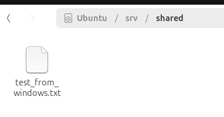
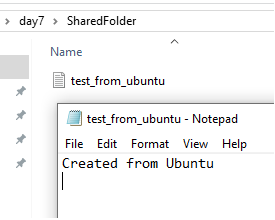

# Cross-Platform File Server (Windows 10 ↔ Ubuntu)

Secure bidirectional file sharing using **Samba (Linux)** and **SMB (Windows)**.

> **Student Project** | System Administration | November 2025  
> **Author:** Tigromag

---

## Tech Stack
| Component       | Technology              |
|----------------|-------------------------|
| Linux Server   | Ubuntu 24.04 + Samba    |
| Windows Client | Windows 10 + SMB Share  |
| Network        | Host-Only (192.168.56.0/24) |
| Security       | `valid users`, `sambashare`, `hosts allow` |

---

## Features
- [x] Access Windows from Ubuntu via CIFS
- [x] Access Ubuntu from Windows via Samba
- [x] User authentication (`admin1` / `P@ssw0rd`)
- [x] Group-based permissions (`sambashare`)
- [x] Remote access via **SSH** and **RDP**

---

## Project Structure
cross-platform-file-server/
├── configs/
│   ├── smb_ubuntu.conf
│   └── windows_shares.txt
├── docs/
│   ├── windows_to_ubuntu.png
│   ├── ubuntu_to_windows.png
│   └── final_structure.png
└── README.md
text---

## Screenshots
| Description                   | Image |
|------------------------------|-------|
| Windows → Ubuntu (Samba)     |  |
| Ubuntu → Windows (CIFS)      |  |
| Final Structure (Dual View)  |  |

---

## Configuration

### Ubuntu (`/etc/samba/smb.conf`)
```ini
[shared]
    path = /srv/shared
    valid users = admin1
    force group = sambashare
    hosts allow = 192.168.56.0/24

### Windows
Share: C:\SharedFolder
User: admin1 with Full Control
